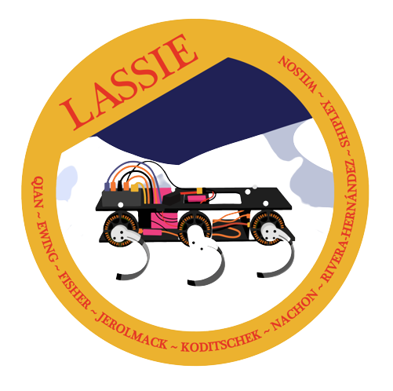

# LASSIE: Legged Autonomous Surface Science In Analogue Environments

Welcome to LASSIE! The overall study objective is to enhance scientific outcomes of robot-aided planetary explorations, by integrating high mobility legged robots with embedded
terrain-sensing technologies and cognitive human decision models. State-of-the-art rovers
and robots typically operate based on pre-programmed agenda, and have limited capabilities to: 

i) effectively detect unexpected changes in terrain properties and responses and adjust
locomotion or sampling strategies; 

ii) autonomously identify scientifically-valuable observations and adjust exploration strategies. 

Such inefficiency can lead to critical mobility
or sampling failures, and missed scientific discoveries. To bridge this gap, we propose to
integrate legged mobility, direct-drive embedded terrain-sensing, and human-robot collab-
orative decision-making workflow, to enable terrain-sensible, discovery-driven legged
robots that can effectively move, adaptively situate, and scientifically examine a wide range
of planetary environments. 

## 🛠 LASSIE_ROBOT_CONTROLLER
LASSIE_ROBOT_DRIVER is a repository that contains the high level controller for differnt robot we use including field robot and lab robot. 
- traveler_leg
- minirhex robot for lab
- turtle_robot for lab

## 🏫 Usage
- traveler_leg

hardware requirements: connects the odrive to your computer

run:
```
ros2 run traverler_high_controller traveler_high_controller
```
- minirhex robot

hardware requirements: connects the odrive board and servo board to your raspberry pi

```
ros2 run mini_rhex_controller mini_rhex_controller 
```
- turtle_robot

hardware requirements: connects the dynamixel shied to your computer through usb
```
ros2 run turtle_high_controller turtle_high_controller 
```


## 📎 Useful commands
```
sudo chown qianlab /dev/ttyUSB0
```